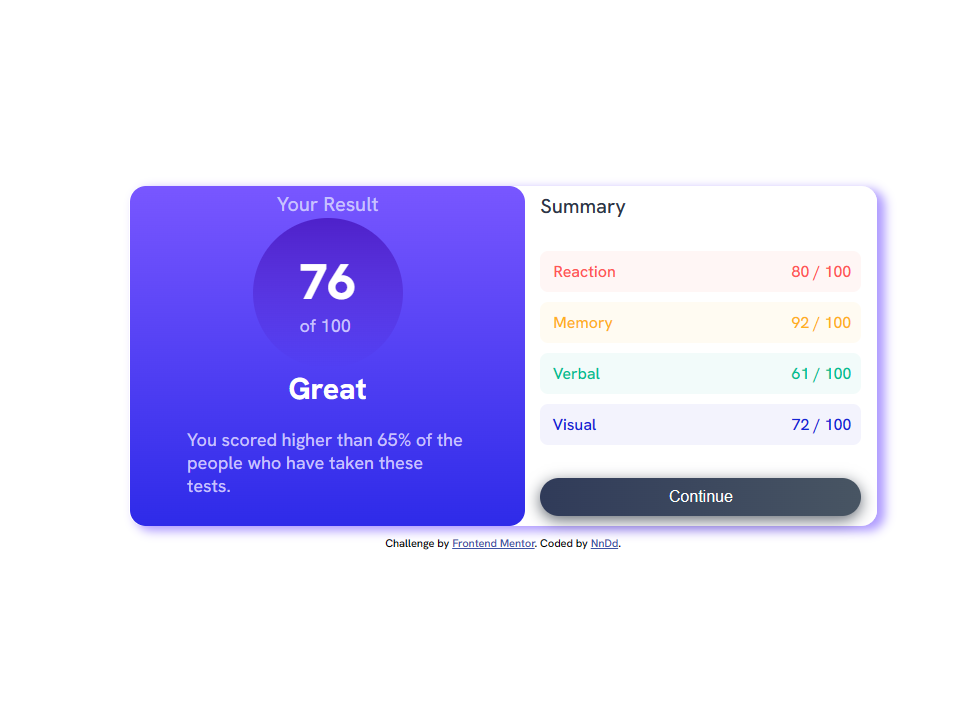
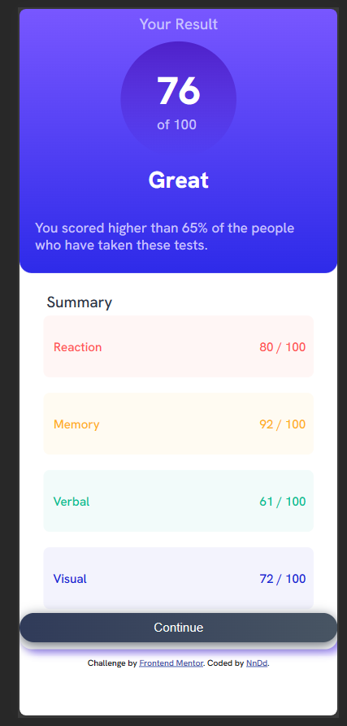

# Frontend Mentor - Results summary component solution

This is a solution to the [Results summary component challenge on Frontend Mentor](https://www.frontendmentor.io/challenges/results-summary-component-CE_K6s0maV). Frontend Mentor challenges help you improve your coding skills by building realistic projects.

## Table of contents

- [Screenshot](#screenshot)
- [Links](#links)
- [Built with](#built-with)
- [Continued development](#continued-development)
- [Author](#author)
- [Acknowledgments](#acknowledgments)

### Screenshot

### Links

- Solution URL: [Add solution URL here](https://github.com/Nn-Dd/Result_Summary_Component)
- Live Site URL: [Add live site URL here](https://nn-dd.github.io/Result_Summary_Component/)

### Built with

- Semantic HTML5 markup
- CSS custom properties
- Flexbox
- Mobile-first workflow

### Continued development

In the future i will implement the json to the code.

## Author

- Website - [Andy Jimenez | NnDd](https://github.com/Nn-Dd)
- Frontend Mentor - [@NnDd](https://www.frontendmentor.io/profile/Nn-Dd)
